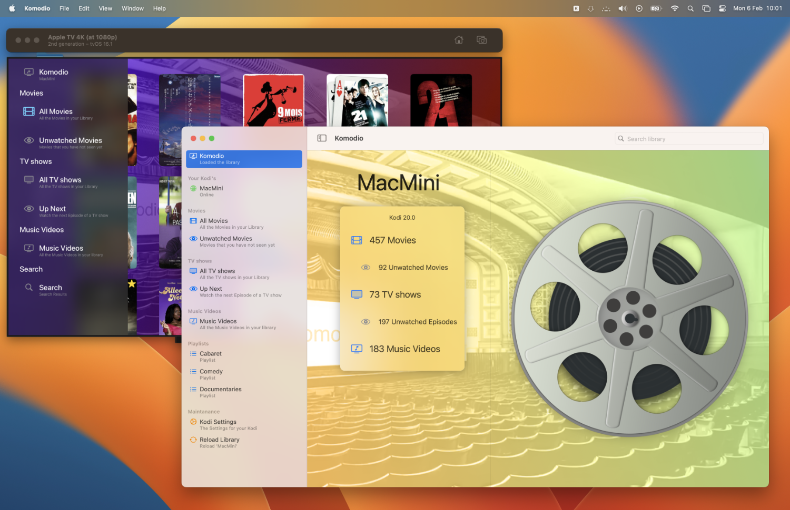

#  Komodio

## An `Apple TV` Video Client for  [Kodi](https://kodi.tv)

Komodio is a video player for tvOS 16 that can stream videos from your local Kodi host.

*The folder 'KomodioTV' contains the current version for tvOS; the folder 'Komodio' will be a brand new version for macOS and tvOS and is currently 'work in prgress'...*

### Limitations

- Because it's an `Apple` client using AVkit, it can only play Quicktime compatible files. So, **no MKV's**...
- Komodio depends on Bonjour to find your Kodi hosts.
- The 'Kodi login' configuration is using default settings.
- If your media is on a harddisk and it's sleeping; the media wil sometimes not start because of a timeout. Try again and it will work.
- Komodio is written in SwiftUI 4, so well, a bit buggy :-)

## Dependencies

Komodio depends on the following Swift Package that are in my GitHub account:

- [SwiftlyKodiAPI](https://github.com/Desbeers/swiftlykodiapi). The Swift API to talk to Kodio.

## What's in a name?

*Komodio* has no meaning. I wrote an audio remote application for Kodi named [Kodio](https://github.com/Desbeers/Kodio/), so wanted something similar..

## How to compile

1. Clone the project.
2. Change the signing certificate to your own.
2. Build and run!
